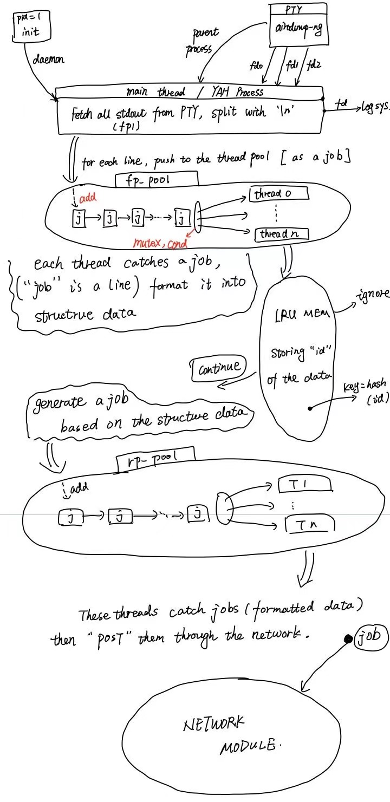

# YAH

## Description
YAH is a tool based on ``airodump-ng`` running on Raspberry.
It captures all the outputs of ``airodump-ng`` and tries to format
them into structed data. In the previous implementation, we found
that because ``airodump-ng`` flushes the screen so fast that it
causes lots of resource of our system, especially CPU. Hence, YAH
is built for solving all these problems.

YAH is still working in progress.

## System Introduction
To fetch, store and upload all data, we need to deal with these job:

1. Run ``airodump-ng`` command.
2. Fetch the output from ``airodump-ng``.
3. Format and store each line of the output into local storage. We use sqlite3 as our database.
4. During the last step, if we found that some message had appeared in the past short time, we would ignore them. Hence, we **might** need to check our database again to fetch the newest information. It might cause much I/O.
5. After a line stores into the database, we fetch them from database and post them to our remote storage. Note that if there is no change in our database, this step still causes I/O.
6. When the program errors, like unexpected stops, ``airodump-ng`` stops, network errors unexpectedly, the program should try rebooting in order to restart itself. We use supervisord to keep it healthy, but sometimes, supervisord may work failed when the system started, supervisord doesn't start our program.

Because of the issues above, we (will) try these solutions:
1. Make our program as a background program, daemond by the kernel(i.e, init)
2. We use C to rebuild our program. We deal with file descriptor(fd) directly, using pseudo terminal to run ``airodump-ng`` so that we can use ``airodump-ng`` directly. (Previously, we modify some code in ``aircrack`` to make it flush the stream, or control the windows size).
3. We run ``airodump-ng`` in pseudo terminal, as a coprocess. Using pipe to fetch "output" of ``airodump-ng``.
4. In YAH, we build our thread pool to manage jobs. The program needn't try checking from database. If there is a new line to be posted, we put it into our thread pool as a job, our threads will run that job.

The picture below shows the whole system of YAH.


## Install and Run
Note that currently, YAH can **only** fetch and store data into mysql. Besides, the only way to install is to build the source code yourself.

Firstly, clone this repo:
```
git clone https://github.caojen/yah.git
cd yah
```

Then, you may need to modify some configures:

1. If you want to run in ``DEBUG`` mode, please open ``src/yah_const.h``. You can change the config here.
2. Otherwires, you need to remove ``DEBUG`` flag. Please open ``Makefile``, at line 6, set ``DEBUG:=``

You can run ``make`` to build now.

After the ``make`` done, a binary file ``yah`` is stored into ``./bin`` directory. You can run like:
```
./bin/yah start
```

**If you are not the root, you should use ``sudo``.**

If you want to stop the program, just run:
```
./bin/yah stop
```

The configure file is stored in ``config.yaml``. You may check your ``src/config.h`` and rebuild if needed.

All the configures contain a key and a value. Key is a string (which can be formatted as ``%s``), value is just a integer (can be formatted as ``%d``).

Currently, the configures include:
```conf
# log level:
## 1. LOG or DEBUG
## 2. WARN
## 3. ERROR
log_level 1

# rpworkers
## specify the number of workers in rp_pool
rpworkers 1

# fpworkers
## specify the number of workers in fp_pool
fpworkers 1

# device_number
## specify the number of this device
## change the number if you like
device_number 362
```

Note that you need to install ``airodump-ng`` and ``libsqlite3`` in your device. See ``src/const.h`` for more infomation.

## Local Storage
Our database is sqlite3. The path is specified in ``src/yah_const.h``. Check the path yourself, and rebuild the program if needed.

You can use ``sqlite3 <sqlite3_file_name>`` to see what data is collected. There are 2 tables in the database, ``ap`` and ``apstation``, indicates the 2 types of output from ``airodump-ng``.
